# AI Zendesk Import Assistant

## Context, Business Use Case, Architecture, and Benchmark

| Document field | Value |
| --- | --- |
| Purpose | Canonical product, engineering, demo, and AI-agent context |
| Repository | `zendesk-ai-import-assistant-1` |
| Last verified | 2026-07-23 |
| Current stage | Working proof of concept with controlled Zendesk deployment |
| Benchmark policy | Read, generate, stage, validate, and preview only unless a human explicitly approves deployment |
| Secret policy | Credentials and API keys are environment-only and are intentionally excluded from this document |

## 1. Executive Summary

The AI Zendesk Import Assistant converts a natural-language business request into a structured, reviewable Zendesk operating model. It supports four user-facing workflows: create a new configuration, update one exact synchronized object, plan a mixed create-or-update change, or ask read-only questions about the current instance and a proposed batch. Durable conversations let users return to prior work from the left navigation, reopen a nested generation batch, restore its operating context, and continue the same chat.

The system is designed as a controlled configuration copilot, not an autonomous administrator. It synchronizes the current Zendesk catalog, answers grounded questions from fresh instance context, creates or updates records in dependency order, uses Gemini as the default drafting and quality-supervision model, falls back to Groq when required, stages results in Google Sheets through Apps Script, validates every record, and requires human approval before any Zendesk write.

The core workflow is:

```text
Connect and synchronize Zendesk
-> start a uniquely named chat or resume a past chat and nested batch
-> choose Create, Update, Create or Update, or Ask or Verify
-> Ask or Verify: refresh context, answer with validated citations, and perform no writes
-> change workflow: describe the business requirement and select context where required
-> plan required objects and dependencies
-> generate records in waves
-> supervise, patch, and validate each wave
-> stage and validate in Google Sheets
-> preview readable before/after logic
-> optionally ask grounded questions about proposed effects before applying
-> approve selected records
-> deploy Support objects
-> optionally deploy Help Center content after Guide readiness is confirmed
-> log every result
```

The latest ClearSky benchmark produced a 39-record insurance configuration in 135.96 seconds with no blocked chunks, no duplicate titles, no duplicate action fields, and an average effective supervisor quality score of 1.00. A separate 39-record Apps Script stress replay completed in 26.00 seconds client-side. Combining those controlled measurements gives an evidence-based demonstration estimate of about 2 minutes 42 seconds, comfortably below the 10-minute session target. This is an estimate across separate runs, not a single end-to-end stopwatch result.

## 2. Business Problem

Zendesk implementation work requires consultants and administrators to translate operating requirements into many related objects. That work is repetitive but risky because object dependencies, rule order, routing IDs, field options, Help Center structure, and existing instance configuration must all remain consistent.

Typical manual work includes:

1. Discovering departments, processes, service rules, forms, fields, and knowledge topics.
2. Inspecting the existing Zendesk instance for names, IDs, dependencies, and conflicts.
3. Designing groups, fields, forms, views, triggers, automations, macros, categories, sections, and articles.
4. Re-entering configuration through Zendesk or spreadsheets.
5. Checking rule logic, duplicate names, references, and deployment order.
6. Obtaining approval and recording what changed.

The assistant reduces this translation and configuration effort while keeping the final decision with a human operator.

## 3. Business Value

| Outcome | Business value |
| --- | --- |
| Faster solution design | Converts a detailed operating brief into a structured preview in minutes rather than manually drafting every object |
| Better coverage | Treats named departments, forms, topics, and operational rules as explicit manifest requirements |
| Safer changes | Exact Update mode starts from a synchronized object snapshot and preserves fields the user did not ask to change |
| Grounded decisions | Answers instance and pre-apply questions from a fresh catalog plus the actual proposed records, with validated object citations |
| Explainable review | Shows readable conditions, actions, dependencies, warnings, and before/after changes instead of raw JSON only |
| Controlled deployment | Requires deterministic validation and explicit human approval before Zendesk writes |
| Auditability | Stores staged records, validation results, approvals, model usage, progress events, and execution results by batch ID |
| Conversation continuity | Keeps uniquely named chats in searchable history, nests generated batches under each chat, and restores the saved workflow state and messages |
| Resilience | Uses targeted retries and deterministic fallback without regenerating an already approved batch |
| Demo suitability | Produces operational progress summaries while work is running, avoiding a silent waiting screen |

## 4. Target Users

- Zendesk implementation consultants
- Solution architects
- Customer experience operations teams
- Zendesk administrators
- Pre-sales and demonstration teams
- Governance or compliance reviewers approving configuration changes

## 5. Primary Business Use Cases

### 5.1 Create a New Operating Model

The user selects **Create**, describes the company, departments, products, workflows, forms, routing rules, macros, views, automations, and Help Center topics, then asks the assistant to design the required Zendesk configuration.

The backend extracts a coverage manifest and generates the configuration in dependency waves. For a department-heavy prompt, each department becomes a first-class coverage requirement rather than optional context.

Expected result:

- A complete staged configuration, not a small sample.
- Every generated object is mapped to a department, topic, or shared dependency.
- Missing mandatory coverage is visible in preview metadata.
- The user can approve, skip, or hold individual records before deployment.

### 5.2 Update One Existing Zendesk Object

The user selects **Update** before entering instructions. Prompt entry remains locked until the user selects one exact object from the synchronized Zendesk catalog.

The UI gives Gemini a starting point containing:

- object type;
- exact Zendesk object ID;
- current name or title;
- synchronized snapshot;
- snapshot integrity hash;
- related object names and IDs required to understand the rule.

The generator must return one complete final-state record for that same target. The backend preserves unchanged conditions and actions, rejects invented IDs, and deploys through the target-specific update endpoint only after approval.

The preview should present:

```text
Current configuration
Requested change
Proposed final configuration
Fields preserved
Fields added, changed, or removed
Validation and supervisor decision
```

### 5.3 Plan a Mixed Create-or-Update Change

The user selects **Create or Update** when a business request may require adding missing configuration while accounting for objects that already exist. The prompt remains locked until the Zendesk catalog has synchronized, and the workflow includes compact snapshots of selected or matching current objects as planning context.

The current implementation treats this as a guarded planning profile over the create pipeline: it instructs the planner to create missing objects, avoid duplicate exact titles, and consider synchronized dependencies. Every emitted record still has an explicit final operation of `create` or `update`. Exact ID-bound replacement remains governed by the stricter Update contract; the mixed workflow must not silently overwrite an existing object unless that record is explicitly bound to a synchronized target and shown as an update in preview.

### 5.4 Ask or Verify Current Configuration

The user selects **Ask or Verify** to open a separate read-only workspace. They can ask about the whole synchronized instance or narrow the question by object type, search text, and selected objects. This supports questions such as:

- Which triggers route claims tickets?
- Does this form already contain the required policy field?
- Which automations could overlap with the proposed escalation rule?
- Can the current instance support the requested workflow without creating a duplicate object?

Every question performs a fresh server-side Zendesk catalog sync. The answer is grounded in the current object catalog, uses validated citations to supplied object names and IDs, identifies facts it cannot verify, and cannot create a batch, approve records, or write to Zendesk.

### 5.5 Generate and Publish Help Center Content

Help Center records are generated in dependency order:

```text
category -> section -> article
```

Article generation does not imply that Zendesk Guide is enabled or publishable. Support objects can be approved and deployed first. The assistant then checks Help Center readiness for the selected brand and locale.

If Guide is unavailable, the workflow stops before article deployment and asks the user to enable the Help Center and provide or confirm the correct brand URL. After readiness is verified, categories and sections are created or resolved before articles are pushed. Article deployment remains a separate explicit confirmation.

### 5.6 Preview, Question, and Approve Changes

Generated records are shown as readable product UI, not only serialized JSON. Users can inspect nested condition groups, actions, dependencies, warnings, and effective approval results. In Update mode they can compare the current and proposed state.

Before applying a batch, the user can select **Ask before applying** and question the likely effects on routing, agents, customers, reporting, dependencies, conflicts, or existing rules. The backend combines a fresh instance sync with the actual proposed batch records and returns a read-only impact assessment. Asking a question does not change approval decisions or deployment state.

Human approval is record-level. A front-end request cannot override failed validation, blocked status, or deployment scope restrictions.

### 5.7 Keep the User Informed During Long Runs

The application emits verified operational progress events as each wave advances. A low-volume narrator turns those events into concise public summaries about what was checked, created, patched, carried forward, or left unresolved.

These messages are operational summaries only. The product does not expose hidden chain-of-thought.

### 5.8 Resume Past Chats and Batches

The left navigation contains a searchable **Past chats** tree. A conversation is the parent and every generated batch from that conversation appears beneath it. Selecting a conversation restores its messages, operation mode, focus objects, selected context, exact update target, and most recent batch. Selecting a nested batch restores that specific preview while keeping the parent conversation active, so the next question or generation request continues in the same conversation ID.

The first user message receives an immediate unique provisional title so chat creation does not wait for another model call. A background title task then asks Gemini for a concise business-specific name, falls back to Groq if required, and retains the deterministic title if both providers fail. Uniqueness is enforced by backend storage. Existing batches are backfilled as legacy conversations without triggering title-model traffic.

## 6. Functional Scope

### 6.1 Create, Exact-Update, and Deploy Capable

| Zendesk object | Sync existing | Create | Exact update | Notes |
| --- | ---: | ---: | ---: | --- |
| Brands | Yes | Yes | Yes | Used to scope Support and Help Center configuration |
| Groups | Yes | Yes | Yes | Exact name and ID resolution is enforced |
| Ticket fields | Yes | Yes | Yes | Options and field type use typed merge or replacement rules |
| Ticket forms | Yes | Yes | Yes | Generated forms reference existing or generated fields |
| Triggers | Yes | Yes | Yes | Routing and meaningful condition/action gates apply |
| Automations | Yes | Yes | Yes | Must include time-based logic |
| Macros | Yes | Yes | Yes | Comment bodies and actions are validated |
| Views | Yes | Yes | Yes | Output columns are merged into one deduplicated action |
| Help Center categories | Yes | Yes | Yes | Requires valid Guide context for deployment |
| Help Center sections | Yes | Yes | Yes | Must resolve a category |
| Help Center articles | Yes | Yes | Yes | Must resolve a section and contain substantive body text |

### 6.2 Synchronized as Read-Only Context

The current integration also synchronizes the following for planning and conflict awareness, but they are not selectable exact-update targets and do not have complete deployment handlers:

- SLA policies
- business schedules
- user fields
- organization fields
- custom objects

The system must label these as read-only or later-phase capabilities instead of implying that they can be changed.

### 6.3 Grounded Read-Only Questions

The `POST /api/import-assistant/context-question` endpoint supports two question scopes:

- `instance`: questions about the freshly synchronized Zendesk catalog, optionally narrowed to selected objects;
- `change_review`: questions about a staged proposal and its effects on the current synchronized instance.

Read-only question answering can use every synchronized object type, including SLA policies, schedules, user fields, organization fields, and custom objects. This does not make those objects selectable update targets. Gemini is the default Q&A model, Groq is the provider fallback, and deterministic text is returned if model generation fails. All paths remain read-only.

### 6.4 Deliberately Out of Scope

- Unapproved Zendesk deployment
- Automatic production changes
- Arbitrary model-authored numeric Zendesk IDs
- Whole-instance replacement
- Hidden chain-of-thought display
- Treating an Ask or Verify response as approval or deployment authorization
- Accepting invented or unvalidated model citations as instance facts
- Automatic Help Center publishing when Guide readiness is unknown
- Silent removal of conditions, actions, tags, or dependencies during Update mode

## 7. Architecture

```mermaid
flowchart TD
    U["User"] --> UI["React and Vite UI"]
    UI --> API["FastAPI orchestration API"]
    UI --> CHATS["Conversation history API"]
    CHATS --> CSTORE["Atomic conversation store"]
    CHATS --> TITLE["Background Gemini title task"]
    TITLE -.->|provider failure| GROQ
    TITLE --> CSTORE

    API --> ZR["Zendesk read-only catalog sync"]
    ZR --> API

    API --> QA["Grounded read-only Q&A"]
    ZR --> QA
    QA --> UI

    API --> PLAN["Coverage manifest and dependency planner"]
    PLAN --> GEN["Gemini default generator"]
    GEN -.->|retry exhaustion or circuit open| GROQ["Groq generator fallback lanes"]
    PLAN --> DET["Deterministic templates and fallbacks"]

    GEN --> SUP["Gemini supervisor"]
    GROQ --> SUP
    DET --> SUP
    SUP --> GATE["Backend deterministic quality gates"]
    GATE --> WAVES["Approved cumulative wave state"]
    WAVES --> PLAN

    GATE --> AS["Secured Google Apps Script web app"]
    AS --> SHEETS["Google Sheets staging and audit tabs"]
    SHEETS --> AS
    AS --> API

    API --> PREVIEW["Readable preview and before/after diff"]
    PREVIEW --> IMPACT["Ask-before-applying impact review"]
    IMPACT --> QA
    QA --> PREVIEW
    PREVIEW --> APPROVAL["Human record-level approval"]
    APPROVAL --> API
    API --> ZW["Zendesk Support deployment"]
    API --> GUIDE["Separate Help Center readiness and deployment phase"]
    ZW --> LOG["Execution log"]
    GUIDE --> LOG
    LOG --> UI

    EVENTS["Verified progress events"] --> NARRATOR["Groq narrator with deterministic fallback"]
    API --> EVENTS
    NARRATOR --> UI
```



## 8. Component Responsibilities

| Component | Primary responsibility | Must not do |
| --- | --- | --- |
| React UI | Select one of four workflows, manage searchable nested chat history, restore saved work, capture prompts and questions, display progress, preview readable logic, switch light/dark theme, and collect approval | Persist provider secrets, call Zendesk directly, or turn a read-only answer into a write |
| FastAPI | Authenticate requests, freshly synchronize context, answer grounded questions, plan waves, route models, validate outputs, enforce approval, stage records, and deploy approved records | Trust model output, model citations, or front-end approval without backend checks |
| Conversation service and store | Persist bounded messages and workflow state, enforce unique titles, associate batches, redact sensitive state, and backfill legacy batches | Store credentials, block generation while naming a chat, or treat chat memory as deployment approval |
| Gemini default generator | Draft planner and generator output using current manifest and synchronized context | Invent IDs, bypass schemas, or deploy records |
| Gemini supervisor | Review department/topic bundles, propose safe patches, identify gaps, and request targeted regeneration | Directly write arbitrary records or override deterministic failures |
| Grounded Q&A service | Select compact relevant instance/proposal context, obtain a structured answer, validate citations, and report unverifiable claims | Approve, stage, patch, deploy, or claim evidence outside supplied context |
| Groq lanes | Fail over generator tasks and provide low-volume progress narration | Become the source of operational truth |
| Deterministic engine | Build stable rule templates, apply typed patches, calculate effective approval, validate dependencies, and provide fallback records | Claim model-level semantic approval |
| Apps Script | Idempotently stage batches, validate rows, preserve metadata/progress, enforce approval writes, return preview, and log execution | Act as the AI planner or bypass backend controls |
| Google Sheets | Provide staging, validation, approval, metadata, progress, and execution audit data | Serve as a secret store for browser clients |
| Zendesk APIs | Supply synchronized catalog context and execute explicitly approved writes | Receive writes during benchmarks or before approval |

### 8.1 User Interface and Theme Contract

The active application is the operating workspace, not a marketing landing page. The four workflow choices appear before prompt or question entry, and the workspace changes to match the selected task. Raw conditions and actions are rendered as readable nested logic, with before/after comparison for exact updates and a dedicated question surface for read-only analysis.

Light and dark modes apply to the complete workspace. The theme controller sets both `data-theme` and the Tailwind-compatible `dark` class on the document root and persists the preference in local storage. Shared cards, buttons, badges, inputs, tabs, selectors, preview panels, Q&A panels, session controls, and pre-apply review use centralized theme variables so one mode does not retain colors from the other.

### 8.2 Free-Tier Deployment Contract

The supported demonstration deployment uses Vercel for the `frontend` Vite build and a Render free Python web service for the `backend` FastAPI application. Vercel receives only the public `VITE_API_BASE_URL`, which points to the Render HTTPS origin. Gemini, Groq, Apps Script, and other server credentials remain Render environment variables.

The root `render.yaml` fixes the backend root directory, Python version, build command, single-worker Uvicorn start command, health path, and free instance plan. `frontend/vercel.json` fixes the Vite build and output directory. The free Render filesystem is intentionally treated as temporary: batches and conversations can reset after a sleep, restart, or redeploy, while Apps Script and Google Sheets staging remain persistent.

## 9. Model Routing and Reliability

### 9.1 Default Route

Gemini is the default provider for planning and generation. The same Gemini integration provides a separate supervisor lane that reviews generated bundles and emits structured patch proposals.

Default model behavior in the repository:

- Default provider: Gemini
- Default Gemini model: `gemini-3.1-flash-lite`, unless overridden by environment configuration
- Gemini generation retries: limited and protected by a circuit breaker
- Generator fallback: Groq through the existing model/key lanes
- Supervisor concurrency: 2
- Supervisor approval threshold: 0.80
- Mandatory-gap score cap: 0.49
- Targeted regeneration attempts: 1
- Review grouping: department/topic bundles
- Grounded Q&A route: default provider with `context_qa` task routing, Gemini-first behavior, Groq fallback, and deterministic final fallback

### 9.2 Why the Roles Are Split

Generation and supervision are separate concerns. The generator drafts records. Gemini supervision checks quality and context continuity. Backend code decides effective approval and applies only safe, typed patches. Groq preserves availability when Gemini errors repeatedly or a circuit breaker opens.

This avoids allowing one model response to both create and approve its own unrestricted changes.

### 9.3 Progress Narration

Progress narration is intentionally low volume. The narrator receives verified event facts, not private model reasoning. Groq is the preferred narrator when available because the latest synthetic comparison was faster than Gemini while maintaining valid and descriptive summaries. Deterministic event text remains the fallback.

## 10. Dependency-Wave Orchestration

Dependency waves run sequentially. Independent work within a wave can run concurrently across available model lanes.

| Wave | Generated objects | Dependency purpose |
| ---: | --- | --- |
| 1 | Help Center categories and sections | Establish article destinations |
| 2 | Department groups and shared ticket fields | Establish routing and form dependencies |
| 3 | Department ticket forms and views | Build operational intake and queues |
| 4 | Triggers, automations, and macros | Build routing, time logic, and agent actions |
| 5 | Help Center articles | Draft content into verified sections |

Each wave checkpoint requires:

1. All source chunks in the wave to finish generation or controlled fallback.
2. All ready Gemini review bundles to finish or time out according to policy.
3. Safe patches to be applied using stable `record_key` and `chunk_id` targets.
4. Structural and semantic validation to run after patching.
5. Failed chunks to receive one targeted retry without changing neighboring chunks.
6. Verified records to be committed to cumulative context and memory.
7. Unresolved chunks to be marked visibly blocked before the next wave.

## 11. Department-First Coverage

For multi-department prompts, the planner creates a coverage manifest containing:

- named departments;
- explicitly requested forms and fields;
- Help Center topics;
- operational rules;
- shared dependencies;
- required object counts by department and type.

The heavy inferred minimum per department is:

| Object type | Minimum per department |
| --- | ---: |
| Group | 1 |
| Ticket form | 1 |
| Views | 2 |
| Triggers | 3 |
| Macros | 3 |
| Automations | 2 |
| Articles | 2 |

Explicit user counts override inferred minimums where appropriate. Missing coverage can reach preview with warnings, but deterministic gates prevent the missing item from being silently treated as approved for deployment.

## 12. Enforced Supervisor Quality Gate

Gemini returns a raw review decision. Backend code calculates the effective decision.

For a chunk to be effectively approved, all of the following must be true:

- Gemini approved it, or non-strict supervisor fallback policy applies after a transport failure.
- Gemini did not request regeneration.
- Effective quality score is at least 0.80.
- Expected object type and record count match.
- Required department or topic coverage is present.
- Current-wave dependencies resolve to actual existing or generated records.
- Rule objects have meaningful conditions and actions.
- Trigger routing, automation time logic, view output columns, form field references, and article destinations pass object-specific checks.
- No structural or semantic validation failure remains after patches.

If mandatory current-wave coverage is missing, the backend caps the effective score at 0.49 even when Gemini gives a higher score. Raw and effective scores are stored separately.

### 12.1 Safe Patch Behavior

Gemini proposes patches; backend code applies them deterministically.

Allowed examples:

- merge tags into one normalized action;
- replace an article body action;
- merge view columns into one deduplicated action;
- merge field options by normalized value;
- replace a scalar field type;
- add exact name-based group or form routing when the name is known;
- improve descriptions, dependency notes, and substantive body text.

Rejected examples:

- delete a record;
- replace a record ID;
- change object type;
- invent an unknown or numeric routing ID;
- rewrite an entire wave;
- contradict an explicit prompt constraint;
- target an unknown record or dependency.

Verified supervisor memory is derived only from records that actually exist after patching and pass effective approval. Free-form `memory_delta` remains a suggestion and cannot become operational truth by itself.

## 13. Change and Question Safety

### 13.1 Exact Update Safety

Update mode is deliberately stricter than Create mode.

1. The backend performs a complete catalog sync and returns a `sync_id`.
2. The user selects one supported object from that synchronized snapshot.
3. The request carries the exact target ID, type, title, snapshot, and integrity hash.
4. The prompt instructs the model to modify only that target and return one final-state record.
5. Backend validation checks target identity and preserves unrequested conditions and actions.
6. Patch merging replaces or merges matching targets instead of appending duplicate scalar actions.
7. The preview shows the before/after difference.
8. Deployment uses the Zendesk update endpoint for the selected ID only after approval.

Zendesk tag semantics are handled explicitly: additive tag changes use `current_tags`; `set_tags` is reserved for an explicit full replacement because it replaces the entire tag set.

### 13.2 Grounded Read-Only Q&A Safety

The question service is isolated from staging, approval, patching, and deployment code paths.

1. Each call performs a fresh server-side catalog sync; a supplied `instance_sync_id` is advisory and is never the sole evidence source.
2. `instance` questions may include up to 25 selected context objects and eight prior conversation turns.
3. `change_review` questions require a valid `batch_id` and load the actual records currently stored for that proposal.
4. The service sends a compact relevant catalog, a complete current-name index, proposal details, and a deterministic change summary to the model.
5. Synchronized titles, descriptions, article bodies, comments, and snapshots are treated as untrusted data rather than executable instructions.
6. Model output must follow the structured answer contract: answer, findings, impact, risks, recommended checks, unverifiable items, citations, confidence, scope, warnings, provider, model, fallback, usage, and timestamp.
7. Citations are accepted only when they match a supplied current or proposal object. Rejected citations are counted in response warnings.
8. A response that claims it deployed, updated, changed, or approved Zendesk is rejected and replaced with a deterministic read-only fallback.
9. Only change-review summaries are added to the batch audit history, capped at the latest 20 entries. Questions never mutate records or approval decisions.

## 14. Apps Script and Google Sheets Contract

The deployed Apps Script bridge exposes secured actions for setup, schema synchronization, staging, metadata, progress, validation, preview, approval, and execution logging.

Important behavior:

- Batch staging is idempotent by `batch_id` and `record_id`.
- Retrying a batch replaces its prior object rows instead of duplicating them.
- Batch metadata and progress events use stable upsert keys.
- The combined response reports staging, validation, preview, and total server timings.
- Approval writes independently force failed or blocked records back to `blocked`.
- Execution summaries count the latest result for each record.
- The backend timeout is 90 seconds to accommodate Apps Script cold starts.
- Grounded Ask or Verify calls do not require an Apps Script round trip; Apps Script remains the staging, validation, approval, and execution bridge for generated batches.

Core audit tabs include:

```text
Requests
Planning Output
Brands
Groups
Ticket Fields
Ticket Forms
Macros
Triggers
Automations
Views
Categories
Sections
Articles
Recommendations
Validation Log
Approval Log
Execution Log
Batch Metadata
Progress Log
Schema Registry
Integration Secrets
```

Secrets stored in Script Properties or protected integration storage must never be returned in preview payloads or copied into this document.

## 15. Help Center Deployment Gate

Support and Help Center deployment are separate phases.

Before category, section, or article writes, the backend verifies:

- selected brand;
- Help Center host and brand mapping;
- Guide availability;
- locale;
- category and section destination resolution;
- permission to create articles.

If readiness fails, Support deployment can still complete. Help Center records stay staged and the UI gives the user a concrete enablement or URL-confirmation step. Once readiness passes, category and section writes run before article writes. The user still confirms the Help Center deployment separately.

## 16. Metadata and Audit Model

Important batch metadata includes:

```text
metadata.coverage_manifest
metadata.department_coverage
metadata.quality_gates.coverage
metadata.supervisor.reviews
metadata.supervisor.review_units
metadata.supervisor.patch_counts
metadata.supervisor.auto_applied_patches
metadata.supervisor.raw_quality_score
metadata.supervisor.effective_quality_score
metadata.supervisor.effective_approved
metadata.supervisor.approval_gate_reasons
metadata.supervisor.regeneration_attempts
metadata.supervisor.blocked_chunk_ids
metadata.supervisor.verified_memory
metadata.supervisor.remaining_manifest_coverage
metadata.model_usage
metadata.timings
metadata.progress_events
metadata.change_questions
```

Every generated record should retain a stable batch ID, record ID, record key, source chunk ID, operation mode, validation state, approval state, deployment state, and Zendesk object ID when one exists.

`metadata.change_questions` stores a bounded audit summary for the latest 20 pre-apply questions. It records a truncated question and answer, confidence, citations, provider/model, fallback state, and timestamp. Instance-only questions that are not tied to a batch are not written into batch metadata.

Conversation history is separate from batch metadata. Each conversation stores a stable conversation ID, unique title and title source, bounded user/assistant messages, compact restorable workflow state, and ordered batch references. Credential-like keys and tokens are removed before persistence.

## 17. Security and Governance

Non-negotiable controls:

1. Provider keys and Apps Script credentials stay in environment files or server-side secret storage and are never sent to the browser.
2. Zendesk credentials are entered in the browser, scoped to the current tab through `sessionStorage`, and sent only to the FastAPI backend for validation, catalog reads, or an explicitly approved deployment. They must not be written into batch metadata, Sheets, logs, or reports.
3. Production operation requires HTTPS and should replace browser-held Zendesk credentials with a stronger authenticated server-side session or credential broker.
4. Benchmarks and Ask or Verify requests do not call Zendesk write endpoints.
5. Generated records are not deployable until validation and human approval both pass.
6. Backend rules override invalid approval requests.
7. Numeric IDs must originate from synchronized Zendesk context or a prior successful deployment result.
8. Help Center publishing requires a verified destination and separate confirmation.
9. Current and proposal content supplied to a model is untrusted data; model citations must resolve to known context.
10. Public progress messages summarize operations without exposing hidden reasoning.
11. Logs and reports must redact secrets and authentication headers.
12. Production deployment should remain disabled until a separate production-readiness review is completed.
13. Conversation state must contain only compact object references and redacted workflow data; Zendesk or provider credentials must never enter the conversation store.

## 18. Benchmark Scenario: ClearSky Insurance Group

The primary regression scenario models a South African short-term insurer with five teams:

- Personal Lines Support
- Commercial Lines Support
- Claims
- Underwriting
- Client Retention

The prompt explicitly requests:

- 5 ticket fields;
- 6 routing triggers;
- 5 operational views;
- 4 agent macros;
- 3 ticket forms;
- 5 Help Center articles.

The system also creates the dependencies needed to make those records usable: 5 groups, 3 Help Center categories, and 3 sections. The expected operating-model total is therefore 39 records.

## 19. Benchmark Methodology

The benchmark was designed to measure generation quality and processing time without changing Zendesk.

Controls:

- The same ClearSky business prompt was used for the recorded comparison runs.
- Zendesk deployment was disabled.
- External Google Sheet staging was disabled for the model-generation comparison so provider and orchestration behavior could be measured separately.
- A separate Apps Script stress replay measured realistic 39-record staging, validation, and preview time.
- A separate live exact-update run synchronized the Zendesk catalog and generated a no-deployment update preview.
- Token counts come from captured provider telemetry.
- Supervisor quality is the backend effective quality score, not only Gemini's raw opinion.

## 20. Operating-Model Benchmark Results

| Run | Strategy | Wall time | Records | Generator units | Supervisor units | Tokens | Fallback chunks | Blocked | Avg. quality | Avg. article body | Avg. macro body |
| --- | --- | ---: | ---: | ---: | ---: | ---: | ---: | ---: | ---: | ---: | ---: |
| Baseline | Template | 409.00 s | 33 | 32 | 16 | 162,755 | 4 | 5 | 0.61 | 378.0 chars | 191.5 chars |
| Previous optimized | Hybrid | 304.08 s | 42 | 12 | 17 | 193,605 | 1 | 9 | 0.68 | 663.2 chars | 191.5 chars |
| Final optimized | Hybrid | 135.96 s | 39 | 4 | 11 | 116,033 | 0 | 0 | 1.00 | 709.2 chars | 232.0 chars |

Final run details:

- Status: `preview_ready`
- Expected and actual records: 39
- Generator plus supervisor workload units: 15
- Captured provider calls: 20, all successful
- Targeted provider retry: 1
- Gemini tokens: 113,790
- Groq tokens: 2,243
- Supervisor patches applied: 12
- Supervisor patches rejected: 0
- Duplicate titles: 0
- Duplicate action fields: 0
- Blocked chunks: 0

### 20.1 Improvement Summary

Compared with the original baseline, the final run was:

- 66.8% faster;
- 68.8% lower in combined generator and supervisor workload units;
- 28.7% lower in token use;
- improved from 5 blocked chunks to 0;
- improved from 0.61 to 1.00 average effective quality;
- 87.6% richer in average article body length.

Compared with the previous optimized run, the final run was:

- 55.3% faster;
- 48.3% lower in combined generator and supervisor workload units;
- 40.1% lower in token use;
- improved from 9 blocked chunks to 0;
- improved from 0.68 to 1.00 average effective quality.

These comparisons show the effect of consolidated reviews, deterministic-first object construction, targeted retry, stronger prompts, and verified cumulative context. They are proof-of-concept measurements on one machine and provider quota state, not formal provider service-level guarantees.

## 21. Apps Script Benchmarks

### 21.1 Realistic 39-Record Stress Replay

| Metric | Result |
| --- | ---: |
| Records staged | 39 |
| HTTP result | 200, bridge OK |
| Apps Script staging | 14,457 ms |
| Apps Script validation | 6,332 ms |
| Apps Script preview | 1,293 ms |
| Apps Script server total | 22,082 ms |
| Client-observed total | 26,001.5 ms |
| Passed | 39 |
| Warnings | 0 |
| Blocked | 0 |

The replay contained 5 groups, 5 ticket fields, 3 ticket forms, 4 macros, 6 triggers, 5 views, 3 categories, 3 sections, and 5 articles.

### 21.2 Isolated Approval and Idempotency Check

A separate 10-record Apps Script check completed in 26.025 seconds server-side. Nine valid records passed and one deliberately invalid record was blocked. Replaying the same batch did not duplicate rows, metadata or progress remained available, an invalid approval request was forced back to `blocked`, and a nonexistent record ID was rejected.

The first cold request exceeded an earlier 45-second client timeout. The backend timeout is now 90 seconds to absorb occasional Apps Script cold starts without changing the normal warm-run performance.

## 22. Exact Update Benchmark

A live, no-deployment update test selected one synchronized trigger and requested an additive change.

| Metric | Result |
| --- | ---: |
| Catalog sync | 1.569 s |
| Generation | 46.245 s |
| Overall through preview preparation | 47.981 s |
| Model calls | 2 |
| Total tokens | 3,387 |
| Consolidated Gemini reviews | 1 |
| Regeneration retries | 0 |
| Fallbacks | 0 |
| Raw quality score | 1.00 |
| Effective quality score | 1.00 |
| Effective approval | Yes |
| Zendesk write calls | 0 |

The exact target and title were preserved. Existing conditions and existing actions remained present. The requested additive tag behavior used `current_tags`, and no destructive `set_tags` action was introduced.

The synchronized catalog completed with zero warnings and included Support, Guide, SLA, schedule, field, and custom-object context. Read-only object types remained unavailable as exact update targets.

## 23. Progress Narrator Benchmark

The latest three-scenario synthetic comparison used verified orchestration events and attempted no Zendesk deployment.

| Provider | Valid summaries | Average latency | Tokens | Descriptive score |
| --- | ---: | ---: | ---: | ---: |
| Deterministic | 3/3 | 0.01 ms | 0 | 1.000 |
| Gemini | 3/3 | 1,470.27 ms | 974 | 0.667 |
| Groq | 3/3 | 721.44 ms | 1,006 | 0.867 |

Current recommendation: use Groq for low-volume public narration while Gemini remains focused on planning, generation, and supervision. Always retain deterministic event text as the zero-token fallback.

## 24. Demonstration Timing Budget

The 50-minute speaker session should reserve no more than 10 minutes for generation and staging.

| Demo stage | Evidence-based expectation | Presentation action |
| --- | ---: | --- |
| Connect and synchronize | About 2 seconds in the tested instance | Explain that no writes occur during sync |
| Select workflow | Immediate | Show Create, Update, Create or Update, and Ask or Verify before starting the relevant workflow |
| Model generation and supervision | About 2 minutes 16 seconds for final ClearSky run | Discuss live operational summaries and wave progress |
| Apps Script staging, validation, preview | About 26 seconds in the 39-record stress replay | Show Sheets audit data and readable preview |
| Estimated total | About 2 minutes 42 seconds | Keep a saved benchmark preview available as a contingency |
| Safety buffer to 10-minute target | About 7 minutes 18 seconds | Covers provider throttling or Apps Script cold start |

This estimate combines separate controlled model and Apps Script measurements. For the live presentation, do not promise a fixed provider latency. Preflight integrations, keep a saved preview, and do not deploy to Zendesk unless the demonstration explicitly includes a human-approved sandbox write.

## 25. Verification Status

Most recent recorded code verification by area:

- Backend full test suite: 188 passed in 6.84 seconds
- Frontend tests: 17 passed across 3 files
- Frontend production build: passed
- Frontend lint: 0 errors, 1 existing TanStack Table compiler warning
- Apps Script deployed health: operating-model v2 capabilities available
- Live catalog synchronization: complete with zero warnings in the tested instance
- Live chat-history UI check: 53 legacy and current chats rendered in a bounded left-nav scroller; search, nested batch expansion, and resume-to-active-title passed with no browser console errors
- Light/dark UI check: exact-update preview and shared controls rendered in both modes without browser console errors; the light-theme editable contrast issue was corrected

Known build observations:

- Main JavaScript bundle is about 595.39 kB uncompressed and triggers the Vite 500 kB advisory; the main CSS bundle is about 41.49 kB.
- Several PNG assets are approximately 1.3 MB to 2.0 MB.
- These are load-performance optimization opportunities, not generation correctness blockers.

## 26. Acceptance Criteria

### Create Mode

- The user must select Create before entering a prompt.
- Named departments and explicit object requirements must appear in the coverage manifest.
- Dependencies must be generated before dependent records.
- Missing mandatory coverage must be visible and cannot receive silent effective approval.
- Preview must remain available when only specific records are blocked.

### Update Mode

- The user must select Update and one synchronized exact target before entering instructions.
- The generated record must preserve target type, ID, and unchanged configuration.
- Unknown IDs and unknown name-based routing targets must be rejected.
- Preview must show current and proposed logic in non-technical language.
- Only the selected target may be written after approval.

### Create or Update Mode

- Prompt entry must remain locked until the current catalog has synchronized.
- The planner must receive selected or matching current-object context and avoid duplicate exact titles.
- Each proposed record must still declare a concrete `create` or `update` operation in preview.
- No existing object may be silently overwritten without an ID-bound synchronized target and visible before/after treatment.

### Ask or Verify Mode

- Each question must use a fresh server-side catalog sync, even when the UI supplies an earlier sync ID.
- The user may ask across the instance or narrow context to selected synchronized objects.
- Instance questions must not require or create a generation batch.
- Answers must remain read-only, surface uncertainty, and include only citations that resolve to supplied current or proposal records.
- Questions phrased as commands must not stage, approve, patch, or deploy anything.

### Pre-Apply Questions

- A preview-ready batch must expose **Ask before applying** without changing record decisions.
- Change-review questions must load the actual proposed batch and a fresh current catalog.
- Answers should identify likely impact, risk, overlap, and recommended checks while clearly separating facts from items that cannot be verified.
- The latest 20 change-review summaries may be retained for audit; the question path must not mutate proposed records.

### Past Chat Resume

- The left navigation must show searchable conversations with unique titles.
- Generation batches must appear as nested children of their parent conversation.
- Selecting a parent must restore its messages and saved workflow state; selecting a child must restore that exact batch preview.
- New prompts and questions after restoration must retain the same conversation ID.
- Chat naming must be asynchronous and must not add latency to generation.
- Stored conversation state must exclude credentials and token-like values.

### Theme and Readability

- Light and dark modes must update the complete active workspace, including shared controls, selectors, Q&A, preview, comparison, session, and approval surfaces.
- The document root must keep `data-theme` and the `dark` class synchronized.
- Readable condition/action presentation must remain the default; raw JSON is supporting detail rather than the primary interface.

### Supervisor

- Raw and effective approval must be separate.
- Deterministic failures must cap effective score and force targeted regeneration.
- Only failed chunks may retry.
- Approved neighboring chunks must remain unchanged.
- Verified memory must contain only records that exist and passed effective approval.
- Patches must merge or replace typed targets without duplicate scalar actions.

### Apps Script and Deployment

- Staging retries must be idempotent.
- Validation must run before preview.
- Invalid approval requests must remain blocked.
- Zendesk deployment must require explicit human approval.
- Help Center deployment must require verified Guide readiness and separate confirmation.
- Every deployment result must be logged.

## 27. Known Limitations and Next Engineering Priorities

1. Add focused backend route and service tests for grounded Q&A, citation rejection, prompt-injection resistance, deterministic fallback, fresh synchronization, and absence of write side effects.
2. Formalize `create_update` as a backend orchestration contract if true mixed ID-bound updates are required; the current UI workflow intentionally maps through guarded create planning and reserves exact replacement for Update mode.
3. Replace browser-held Zendesk credentials with an authenticated server-side session or credential broker before production use.
4. Add complete create/update handlers and UI selection for SLA policies, schedules, user fields, organization fields, and custom objects if they become required scope.
5. Run one instrumented, single-stopwatch ClearSky flow from synchronization through Apps Script preview to replace the current combined timing estimate.
6. Add a repeatable cold-start benchmark for Apps Script and provider rate-limit conditions.
7. Code-split the main frontend bundle and compress or resize large PNG assets.
8. Add deployment contract tests against a disposable Zendesk sandbox before enabling any production target.
9. Preserve a deterministic demo snapshot so a provider outage cannot consume the speaker session.
10. Replace the local JSON conversation store with a shared database before running multiple backend replicas or providing multi-user production history.

## 28. Important Environment Settings

Values are intentionally omitted.

```text
LLM_DEFAULT_PROVIDER
LLM_PROVIDER
LLM_MODEL_PLANNER
LLM_MODEL_GENERATOR
LLM_MODEL_CLARIFIER
LLM_GENERATOR_MAX_OUTPUT_TOKENS
GEMINI_API_KEY
GEMINI_DEFAULT_MODEL
GEMINI_DEFAULT_MAX_RETRIES
GEMINI_DEFAULT_FAILURE_THRESHOLD
GEMINI_DEFAULT_COOLDOWN_SECONDS
GEMINI_SUPERVISOR_ENABLED
GEMINI_SUPERVISOR_MODEL
GEMINI_SUPERVISOR_MAX_CONCURRENCY
GEMINI_SUPERVISOR_APPROVAL_THRESHOLD
GEMINI_SUPERVISOR_MAX_REGENERATION_RETRIES
GEMINI_SUPERVISOR_REVIEW_GROUPING
GEMINI_SUPERVISOR_AUTO_APPLY_PATCHES
PROGRESS_NARRATOR_ENABLED
PROGRESS_NARRATOR_PROVIDER
CONVERSATION_STORE_FILE
CONVERSATION_STORE_MAX_ENTRIES
CONVERSATION_STORE_MAX_MESSAGES
VITE_API_BASE_URL
APPS_SCRIPT_WEB_APP_URL
APPS_SCRIPT_API_KEY
APPS_SCRIPT_TIMEOUT_SECONDS
ZENDESK_SUBDOMAIN
ZENDESK_EMAIL
ZENDESK_API_TOKEN
FRONTEND_ORIGIN
```

## 29. Evidence and Source Locations

| Evidence | Repository location |
| --- | --- |
| Final ClearSky benchmark | `backend/data/benchmarks/clearsky-report-final-v3/20260717-221137-169189/` |
| Baseline comparison | `backend/data/benchmarks/clearsky-report-final-v3/20260717-221137-169189/baseline-comparison/summary.md` |
| Previous optimized run | `backend/data/benchmarks/clearsky-optimized/20260717-211100-461946/` |
| Progress narrator benchmark | `backend/data/benchmarks/progress-narrator/20260716-021041-581241/` |
| Exact update telemetry | `backend/data/batches.json` |
| Gemini client | `backend/app/api/gemini/client.py` |
| Model routing | `backend/app/api/grok/client.py` |
| Supervisor and deterministic gates | `backend/app/services/gemini_supervisor.py` |
| Wave orchestration and coverage | `backend/app/services/import_assistant_service.py` |
| Exact update prompts | `backend/app/helpers/prompts.py` |
| Grounded question service and citation validation | `backend/app/services/context_qa.py` |
| Grounded question API contract | `backend/app/routes/import_assistant.py`, `backend/app/models/schemas.py` |
| Conversation persistence and AI naming | `backend/app/services/conversation_store.py`, `backend/app/services/conversation_service.py` |
| Zendesk sync and deployment safety | `backend/app/services/zendesk.py` |
| Four-mode selector and exact target UI | `frontend/src/components/chat/OperationModeSelector.jsx` |
| Ask/Verify and pre-apply question workspaces | `frontend/src/App.jsx`, `frontend/src/components/chat/PreviewWorkspace.jsx` |
| Searchable nested chat history | `frontend/src/components/chat/ConversationHistoryNav.jsx`, `frontend/src/App.jsx` |
| Theme tokens and root theme control | `frontend/src/index.css`, `frontend/src/App.jsx` |
| Conversation backend tests | `backend/tests/test_conversation_service.py` |
| Frontend workflow, chat-history, preview, and theme tests | `frontend/src/App.test.jsx`, `frontend/src/components/chat/ConversationHistoryNav.test.jsx`, `frontend/src/components/chat/PreviewWorkspace.test.jsx` |
| Render free-service Blueprint | `render.yaml` |
| Vercel frontend configuration | `frontend/vercel.json` |
| Free-tier deployment runbook | `DEPLOY_FREE_VERCEL_RENDER.md` |
| Apps Script operating-model worker | `Appscripts/src/OperatingModel.gs` |
| Apps Script API | `Appscripts/src/Api.gs` |
| Apps Script install and API notes | `Appscripts/README.md` |

## 30. Canonical Context for AI or Developer Handoff

Use this block when another model or developer needs a concise starting context:

```text
Project: AI Zendesk Import Assistant

Purpose:
Support four controlled Zendesk workflows: create a structured operating model, update one exact synchronized object, plan a mixed create-or-update change, or answer read-only questions about the current instance and a proposed batch. Preserve each workflow as a uniquely named resumable conversation with nested generation batches.

Current architecture:
React/Vite UI -> FastAPI -> fresh Zendesk read-only catalog sync. A conversation service persists bounded redacted messages, workflow state, unique AI-assisted titles, and nested batch references. Ask/Verify branches to grounded structured Q&A with validated citations and no write side effects. Change workflows continue through coverage manifest and dependency waves -> Gemini default generation -> Gemini structured supervision -> backend deterministic gates and typed patches -> Apps Script and Google Sheets staging/validation -> readable preview and optional pre-apply Q&A -> human record approval -> Zendesk Support deployment -> separate Help Center readiness and deployment phase -> execution log.

Model policy:
Gemini is the default planner/generator, supervisor, and grounded Q&A provider. Groq is the provider failover and preferred low-volume progress narrator. Deterministic templates, validation, citation checks, and fallback remain authoritative. Never expose hidden chain-of-thought.

Safety policy:
Never deploy automatically. Never trust model approval or citations by themselves. Never invent Zendesk IDs. In Update mode, require one synchronized target and preserve all unrequested configuration. Ask/Verify and pre-apply questions are read-only and cannot modify approvals or records. Keep Help Center publishing separate until brand, Guide, locale, category, and section readiness are verified.

Quality policy:
Use department/topic review bundles, an effective approval threshold of 0.80, a mandatory-gap score cap of 0.49, one targeted retry for only the failed source chunk, then deterministic fallback and item-level blocking. Commit memory only from records that actually exist after patching and pass effective approval.

Verified benchmark:
The final ClearSky hybrid run generated 39 records in 135.96 seconds, used 116,033 tokens, applied 12 safe patches, had 0 fallback chunks, 0 blocked chunks, 0 duplicate titles/actions, and averaged 1.00 effective quality. A separate 39-record Apps Script replay took 26.00 seconds client-side. Combined demo estimate is about 2 minutes 42 seconds, with no Zendesk write included.

Current limitations:
SLA policies, schedules, user fields, organization fields, and custom objects are synchronized read-only. Mixed Create or Update is currently a guarded planning profile rather than a fully separate backend operation type. Conversation history currently uses an atomic local JSON store and must move to a shared database for multiple replicas or multi-user production use. Stronger credential brokering, frontend asset optimization, and a single-stopwatch end-to-end benchmark are still recommended.
```

## 31. Final Product Principle

The system is not:

```text
Prompt -> AI -> Zendesk
```

It is two controlled paths over freshly synchronized context:

```text
Ask or Verify
-> fresh synchronized instance and optional proposal context
-> grounded answer with validated citations
-> no staging, approval, or write side effects

Create, Update, or Create or Update
-> synchronized instance context and explicit change intent
-> explicit coverage and dependencies
-> model generation with failover
-> enforced supervision and deterministic validation
-> auditable staging and readable preview
-> optional grounded pre-apply impact question
-> human approval
-> controlled Zendesk deployment
```

That sequence is the core business and technical contract of the product.
